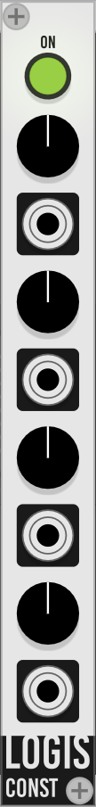
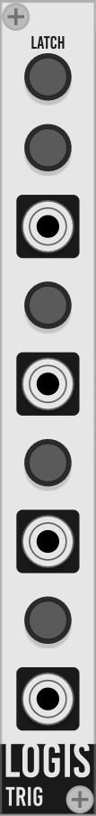

# logis
a plugin for [VCV Rack](https://vcvrack.com/)

### Modules

#### Constant
Outputs four constant but adjustable voltages.
All outputs can be switched on/off simultaneously.
 

#### Trigger
Outputs four manual trigger signals.
All outputs can be made continuous via the latch button.
 
